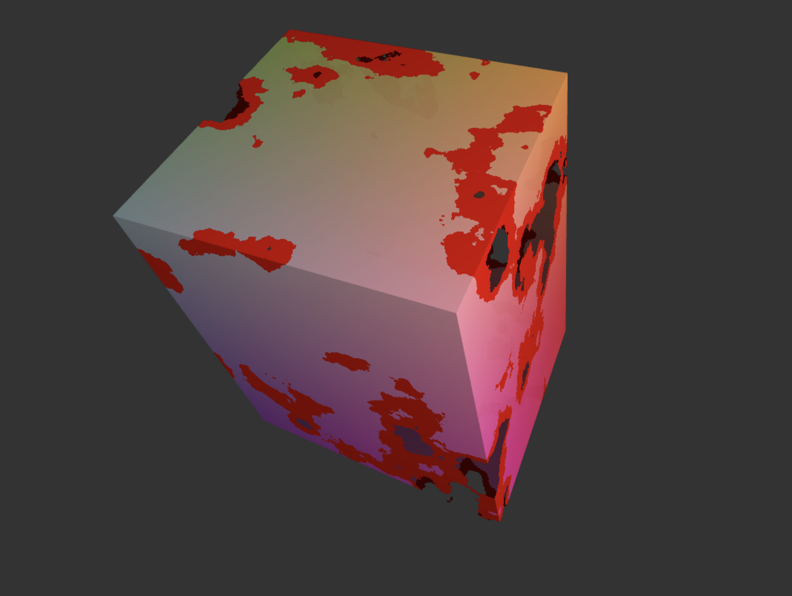

# [Project 1: Noise](https://github.com/CIS-566-Fall-2022/hw01-fireball-base)

## Noise Generation

Across your vertex and fragment shaders, you must implement a variety of functions of the form `h = f(x,y,z)` to displace and color your fireball's surface, where `h` is some floating-point displacement amount.

- Your vertex shader should apply a low-frequency, high-amplitude displacement of your sphere so as to make it less uniformly sphere-like. You might consider using a combination of sinusoidal functions for this purpose.

Tasks Completed:
1. a low-frequency, high-amplitude vertex displacement of the sphere
2. a higher-frequency, lower-amplitude layer of fractal Brownian motion
3. the mixture of two fire colors 
4. eruption animation
5. use sin, impulse, bias and gain functions 
6. 3 interactive controls

Live site: https://angelasiruizhu.github.io/hw01-fireball/
Screenshot:
